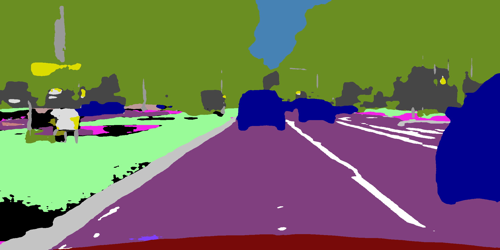
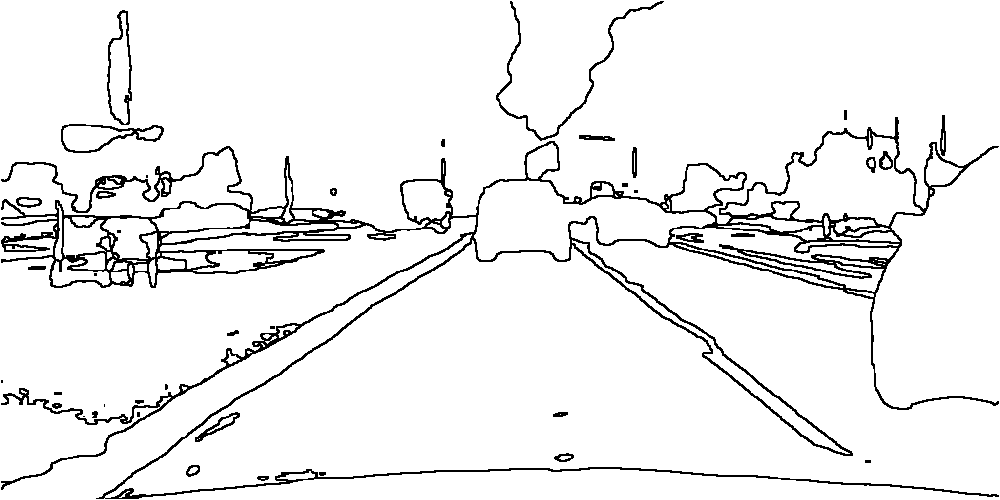
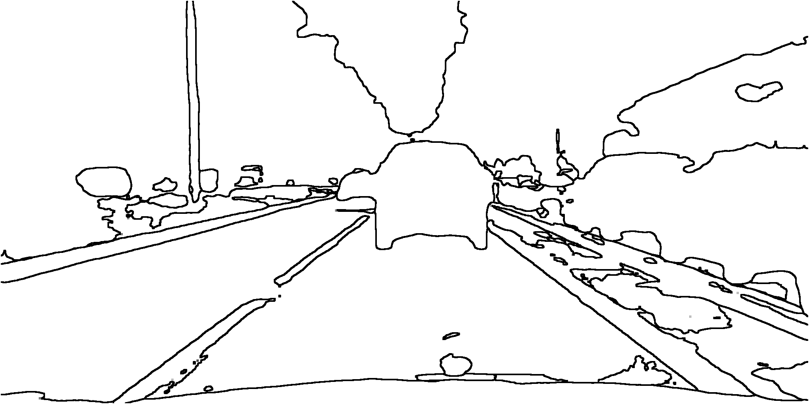
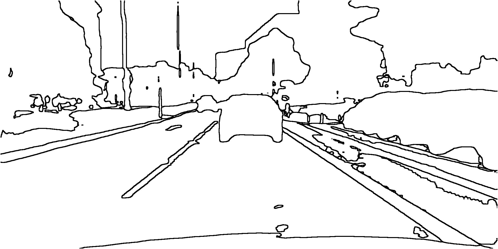

# Readme
  - The model was trained on mapillary vistas-dataset.
    The model was trained for 150k iterations with lr=4e-3, and no wd.
    You can download the pretrained weights from here
  - Going from segmentation map to object boundaries. This task is pretty simple, we check all the neighbouring pixels of a         given pixel if even one of them has a different value we mark the current pixel as black. the same can be see in this block     of code
 ```
 def segmap_to_outline(segmap):
    img_height, img_width = segmap.shape[0], segmap.shape[1]
    segmap = cv2.cvtColor(segmap, cv2.COLOR_BGR2GRAY)
    outline = np.full_like(segmap, 255.)
    for i in range(2,img_height-2):
        for j in range(2,img_width-2):
            pixel = segmap[i, j]
            top = segmap[i+2,j]
            bottom = segmap[i-2,j]
            left = segmap[i,j-2]
            right = segmap[i,j+2]
            top_right = segmap[i+2,j+2]
            top_left = segmap[i+2,j-2]
            bottom_right = segmap[i-2,j+2]
            bottom_left = segmap[i-2,j-2]
            if len(set([pixel, top, bottom, left, right, top_right, top_left, bottom_right, bottom_left])) != 1:
                outline[i, j] = 0
    return np.stack([outline]*3, axis=-1)
 ```
## How it looks


 
 
## Pretrained weights
[Download](https://drive.google.com/file/d/1gysKdd2u5emLieG_Mxynfy24HmfG5X77/view?usp=sharing)


# Results
## Video results
[Part](https://youtu.be/0bJTG15DF1U)

## Image results
</br>

